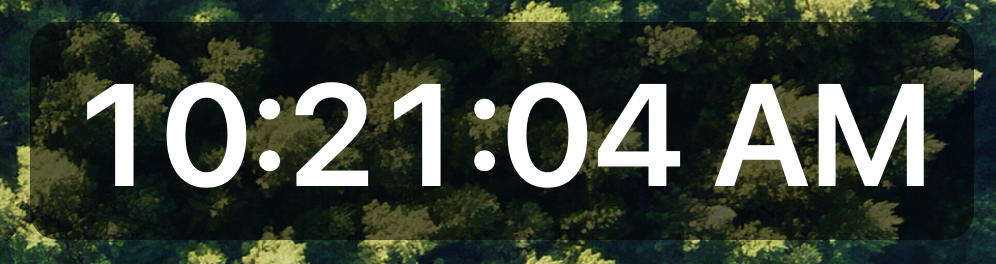
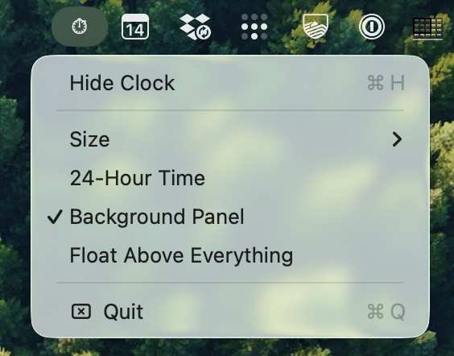

# FloatingClock

An always-on-top `HH:MM:SS` clock for macOS. Built because macOS has no built-in
way to do this — desktop widgets render *behind* all windows by design, and the
stock Clock widget has no seconds display at any size.

Tested on macOS 26.4.1 (Tahoe), Swift 6.3.1.

## Install

No Xcode needed — a pre-built app is included at `dist/FloatingClock.app`.

1. Clone or download this repo.
2. Copy `dist/FloatingClock.app` to `/Applications` (or `~/Applications`).
3. Launch it. The app is ad-hoc signed, so the first launch on your Mac may be
   blocked by Gatekeeper — right-click the app, choose **Open**, then **Open**
   again. If you downloaded the repo as a ZIP and macOS still refuses, clear the
   quarantine flag first:

       xattr -cr /Applications/FloatingClock.app

To start it at login: System Settings → General → Login Items → add it.

## Build

    swiftc -O FloatingClock.swift -o FloatingClock

To rebuild the double-clickable bundle:

    mkdir -p FloatingClock.app/Contents/MacOS
    cp FloatingClock FloatingClock.app/Contents/MacOS/
    # Info.plist is already in the bundle; LSUIElement=true keeps it out of the Dock
    codesign --force --deep -s - FloatingClock.app

If you change the source, rebuild the committed pre-built app the same way so
`dist/FloatingClock.app` stays in sync.

## Use

Double-click `FloatingClock.app`. A `⏱` appears in the menu bar — that's the
whole UI. No Dock icon.

| Menu item | Does |
|---|---|
| Show / Hide Clock | Toggle visibility (⌘H while the menu is open) |
| Size | Small 32 / Medium 48 / Large 72 / Huge 108 pt |
| 24-Hour Time | Switch between 24h and 12h + AM/PM |
| Background Panel | Toggle the translucent rounded backdrop |
| Float Above Everything | `.floating` (above normal windows) vs `.screenSaver` (above almost all system UI) |
| Quit | Exit |

**Drag the clock anywhere** — click and drag the body. Position, size, format and
visibility persist across launches via `UserDefaults`.

## Behaviour notes

- **Window level** is `.floating` by default, which sits above normal windows but
  below system UI. "Float Above Everything" raises it to `.screenSaver`, which is
  useful on a second monitor and intrusive on a laptop.
- **Follows you across Spaces** and stays visible over fullscreen apps
  (`.canJoinAllSpaces`, `.fullScreenAuxiliary`, `.stationary`).
- **Monospaced digits** so the width doesn't jitter as seconds tick.
- Timer runs on `.common` run-loop mode so it keeps updating while you drag it.
- Redraws only when the displayed string actually changes, not 10x/second.

## Why not a widget

macOS desktop widgets (Sonoma onward) sit on the desktop surface, behind every
window. There is no supported way to promote a WidgetKit widget to always-on-top.
Floating requires a regular app with a borderless `NSWindow` at a raised
`NSWindow.Level` — which is what this is, in about 200 lines.

## Support

This project is provided **as-is**, with no support. It scratches a personal
itch and is shared in case it is useful to others; issues and pull requests may
not receive a response.
